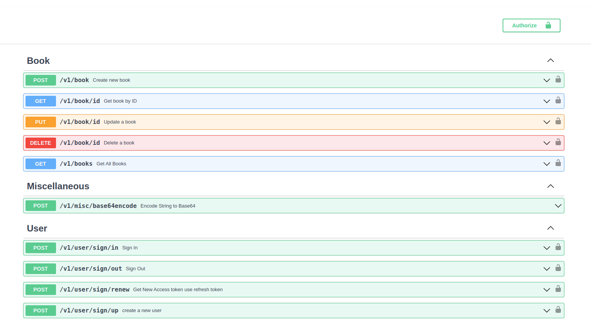
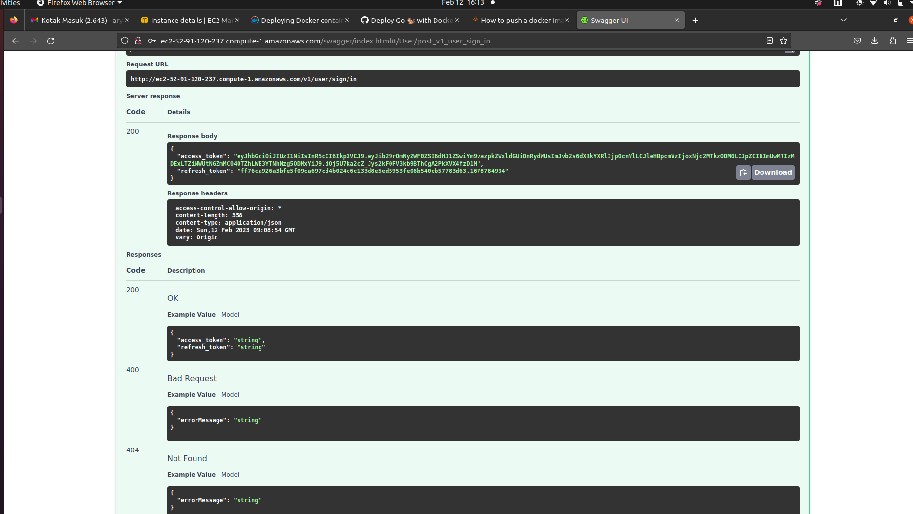

# Building GO rest api using Fiber, PostgreSQL, redis and docker

# Run Service Locally
1. git clone [this repo](https://github.com/aryanicosa/go-fiber)
2. Install Make, Docker, Docker Compose and the following useful Go tools to your system:
   - golang-migrate/migrate for apply migrations
   - github.com/swaggo/swag for auto-generating Swagger API docs
   - github.com/securego/gosec for checking Go security issues
   - github.com/go-critic/go-critic for checking Go the best practice issues
   - github.com/golangci/golangci-lint for checking Go linter issues
3. swag init
4. make run-dependencies
5. make run-local

**Result**

# Development Flow, run with testing:
- Create some changes
- in terminal run: make run-test-dependencies
- open other terminal run: make run
- If all good, commit changes and push to github

# TODO list:
- Database
  - Simplify database connection and init to be once for all (p1)
  - create correct database migration (done)
- Controller
  - refactor code to use token expire and credential checker utility (p2)
  - add basic auth to user and books api (done)
- Utility
  - Create token expire and credential checker function (p3)
- Testing
  - create clean and correct testing (done) : only open testing db once
  - automate testing with Github action (done)
- Swagger doc
  - generate correct and easy to use swagger api (done)
  - consistence response body and response error (done)
- Dockerfile
  - create correct dockerfile (done)
- Makefile
  - create correct makefile (done)
- Docker-compose
  - create correct docker compose file, build and upload image to docker hub (p3)
  - create docker-compose-test.yml file (done)
  - create docker-compose-dependencies.yml file for local development (done)
- Response
  - create constants for type of error response (done)
- Deploy and host go-fiber web app
  - CI/CD - github action
  - aws -> http://ec2-52-91-120-237.compute-1.amazonaws.com/swagger/
  
